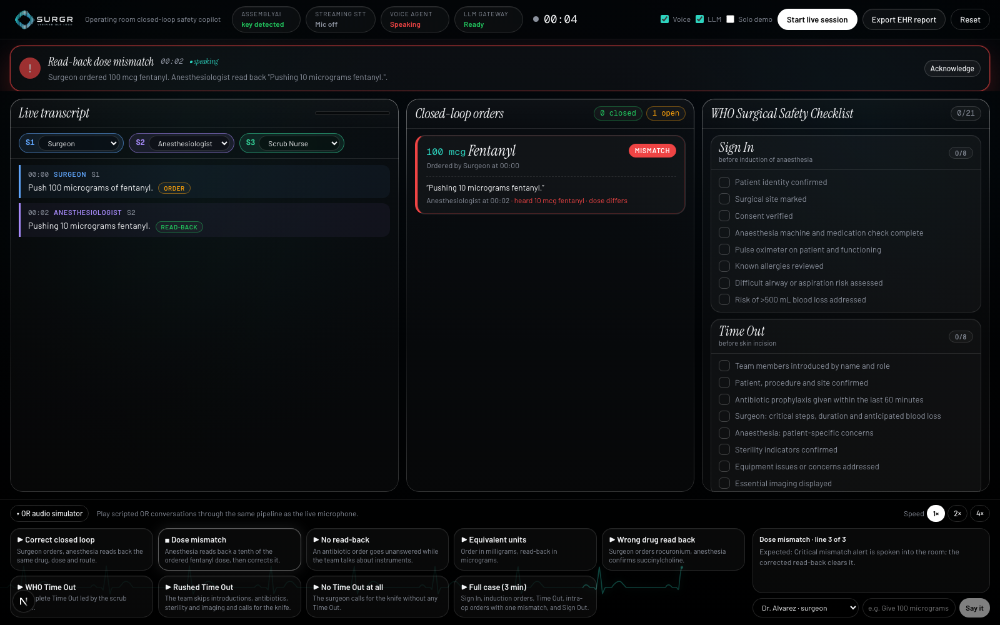

<p align="center">
  
</p>

<h3 align="center">Every verbal order in the operating room, verified out loud.</h3>

<p align="center">
  Surgr listens to the operating room, checks each drug order against its read-back in real time, tracks the WHO Surgical Safety Checklist as the team speaks it, speaks up the moment a loop does not close, and writes the audit record.
</p>

<p align="center">
  <a href="#try-it-in-sixty-seconds">Try it</a> ·
  <a href="#how-it-works">How it works</a> ·
  <a href="#built-on-assemblyai">Built on AssemblyAI</a> ·
  <a href="#getting-started">Getting started</a> ·
  <a href="#deployment">Deployment</a> ·
  <a href="#limitations">Limitations</a>
</p>



Built for the [AssemblyAI Voice Agent Hackathon](https://lablab.ai/ai-hackathons/assemblyai-voice-agent-hackathon) on lablab.ai, September 2026. Source: [github.com/mrnetwork0001/Surgr](https://github.com/mrnetwork0001/Surgr).

> Surgr is a working prototype, not a medical device. It does not replace clinical judgement or institutional safety protocols. See [Limitations](#limitations).

---

## Contents

- [Why Surgr](#why-surgr)
- [What it does](#what-it-does)
- [Try it in sixty seconds](#try-it-in-sixty-seconds)
- [How it works](#how-it-works)
- [Built on AssemblyAI](#built-on-assemblyai)
- [Getting started](#getting-started)
- [Configuration](#configuration)
- [Using the cockpit](#using-the-cockpit)
- [Simulator scenarios](#simulator-scenarios)
- [The operative record](#the-operative-record)
- [Project structure](#project-structure)
- [API routes](#api-routes)
- [Verification](#verification)
- [Deployment](#deployment)
- [Limitations](#limitations)
- [Roadmap](#roadmap)
- [License](#license)

---

## Why Surgr

Drugs in surgery are ordered by voice. The safety standard is closed-loop communication: the order is repeated back, confirmed, then acted on. Aviation made read-backs mandatory decades ago; in an operating room the loop depends on people remembering it under noise, fatigue and time pressure. When it is skipped or misheard, the errors are the familiar ones: a dose off by a factor of ten, two similar-sounding drugs swapped, an antibiotic never given, the incision made before the Time Out is finished.

| Figure | Source |
|---|---|
| About 1 in 20 perioperative medication administrations involves an error or adverse drug event | Nanji et al., *Anesthesiology*, 2016 |
| Major complications fell from 11% to 7% and deaths from 1.5% to 0.8% after adopting the WHO Surgical Safety Checklist | Haynes et al., *NEJM*, 2009 |
| Roughly two thirds of sentinel events involve a breakdown in team communication | The Joint Commission |
| More than 310 million major operations are performed worldwide each year | Weiser et al., 2016 |

Nothing in the room beeps when a read-back does not happen. Surgr is the thing that notices.

## What it does

- **Closed-loop verification.** Every verbal drug order opens a ten-second window for a read-back. Drug, dose, unit and route are compared: 0.1 mg and 100 mcg agree, rocuronium and succinylcholine do not.
- **Speaker-aware.** Speaker labels distinguish surgeon, anesthesiologist and nurse on one microphone, so a read-back from the person who gave the order is caught.
- **WHO checklist, hands-free.** 21 items across Sign In, Time Out and Sign Out tick off from speech. A phase that ends with items skipped, or an incision called without a Time Out, raises an alert.
- **Spoken alerts.** Nobody in an operating room is watching a screen. Alerts are spoken into the room within about a second through AssemblyAI's Voice Agent, then logged.
- **Audit-ready record.** Closed-loop rate, mean read-back time, every medication with order and read-back timestamps, checklist compliance per phase, safety events with resolutions, and recommendations. Exportable as PDF, JSON and print; deliverable by Telegram, email or the device share sheet; and Surgr can read the debrief aloud.
- **Degrades gracefully.** The rules engine, checklist, simulator and local report run without any cloud call. The voice falls back to browser speech synthesis. The LLM is budget-aware and never blocks the safety loop.

## Try it in sixty seconds

1. Open the app and click **Launch app** (the cockpit lives at `/app`). Turn your sound on.
2. In the **OR audio simulator** at the bottom, play **Dose mismatch**. Watch the fentanyl order go red on the order board and hear Surgr speak the alert. The correction that follows turns it green.
3. Play **Rushed Time Out** to hear a checklist alert, or **Full case** at 4× for a three-minute procedure end to end.
4. Click **Export EHR report**. Follow a timestamp back into the transcript, download the PDF, or press **Spoken debrief**.

For the live microphone, see [Using the cockpit](#using-the-cockpit).

## How it works

```
Browser mic ──PCM16 16 kHz──▶ AssemblyAI Streaming v3
                              universal-3-6-pro · medical-v1 · speaker_labels · keyterms
                                       │  Turn events (speaker, words, timestamps)
                                       ▼
                    Rule classifier (sub-millisecond) ──ambiguous drug talk──▶ LLM Gateway (JSON schema)
                                       │  drug_order · read_back · checklist_item · phase
                                       ▼
              Read-back state machine · WHO checklist tracker · alert engine
                      │                                          │
                      ▼                                          ▼
     Voice Agent session (reply.create)              Operative record (local + LLM narrative)
     speaks the alert into the room                  PDF · JSON · print · Telegram · email · spoken debrief
```

1. **Listen.** The microphone is captured with an AudioWorklet, resampled to 16 kHz PCM and streamed over a WebSocket authenticated with a short-lived token. The API key never reaches the browser.
2. **Understand.** Each final transcript turn is classified by a deterministic parser (`src/lib/classifier.ts`) that knows 47 operating-room drugs with brand names and slang, spoken numbers, unit conversion and routes. Only drug-related utterances the rules cannot settle are sent to the LLM Gateway, under a strict JSON schema, and never more often than the account's rate budget allows.
3. **Intervene.** A pure reducer (`src/lib/readback.ts`) tracks orders, deadlines, matches, mismatches, self-read-backs and checklist phases, and emits alerts with spoken text. The Voice Agent speaks them verbatim.
4. **Document.** `buildLocalReport` derives the record from state with authoritative timestamps; the LLM adds narrative sections when available.

The simulator injects scripted text into exactly this pipeline after the speech-to-text step, so scenarios exercise the real engine, alerts and record.

## Built on AssemblyAI

| Surgr layer | AssemblyAI product | Parameters and notes |
|---|---|---|
| Live transcription | Streaming v3, `wss://streaming.assemblyai.com/v3/ws` | `speech_model=universal-3-6-pro`, `domain=medical-v1`, `format_turns=true`, `keyterms_prompt` with drug names and checklist phrases, `min_turn_silence=800`, `max_turn_silence=3600` |
| Who is speaking | Streaming speaker labels | `speaker_labels=true`, `max_speakers=4`; true diarization on a single microphone |
| Ambiguous utterances | LLM Gateway, `https://llm-gateway.assemblyai.com/v1/chat/completions` | JSON-schema outputs; native `response_format` when the account's model supports it, prompt-embedded schema otherwise; rate budget read from `x-ratelimit-*` headers |
| Report narrative | LLM Gateway | Procedure summary, communication notes, per-order notes, recommendations; facts and timestamps always come from Surgr's own state |
| Spoken alerts and debrief | Voice Agent API, `wss://agents.assemblyai.com/v1/ws` | Inline `session.update`, speech driven with `reply.create`; session closes after 90 s idle or when the tab is hidden and reconnects on demand |
| Browser auth | Temporary tokens | `GET /v3/token` and `GET agents.assemblyai.com/v1/token`, minted server-side |

Every integration has been verified against the live services with the scripts in [Verification](#verification). Model access on the gateway is per account: Surgr asks for Claude first and falls back to `qwen3.5-4b-32k-fast`, which every account can use.

## Getting started

Requirements: Node.js 20 or newer, an [AssemblyAI API key](https://www.assemblyai.com/dashboard), and Chrome or Edge for the live microphone.

```bash
git clone https://github.com/mrnetwork0001/Surgr.git
cd Surgr
npm install
cp .env.example .env.local        # then paste your key into ASSEMBLYAI_API_KEY
npm run dev
```

Open http://localhost:3000 for the landing page and http://localhost:3000/app for the cockpit.

Other commands:

```bash
npm run build     # production build
npm run start     # serve the production build
npm run lint      # ESLint
npx tsx scripts/simulate.ts   # run all scenarios through the engine without a browser
```

## Configuration

All configuration is by environment variable; `.env.example` documents each one.

| Variable | Required | Purpose |
|---|---|---|
| `ASSEMBLYAI_API_KEY` | Yes, for live features | Streaming tokens, Voice Agent tokens and the LLM Gateway. Never sent to the browser. |
| `SURGR_CLASSIFY_MODEL` | No | Gateway model for utterance classification. Default `claude-haiku-4-5-20251001`, with automatic fallback. |
| `SURGR_REPORT_MODEL` | No | Gateway model for the report narrative. Default `claude-sonnet-4-6`, with automatic fallback. |
| `SURGR_FALLBACK_MODEL` | No | Model used when the account lacks access to the above. Default `qwen3.5-4b-32k-fast`. |
| `SURGR_VOICE_ID` | No | Voice Agent voice. Default `george`. |
| `TELEGRAM_BOT_TOKEN` | No | Enables **Send to Telegram** from the report. |
| `RESEND_API_KEY`, `SURGR_EMAIL_FROM` | No | Enable **Email PDF** from the report. |
| `NEXT_PUBLIC_SITE_URL` | No | Public origin used for Open Graph image URLs in production. |

Without a key, the simulator, rules engine, checklist and local report all work and the voice uses browser speech synthesis.

## Using the cockpit

**Header.** Service status pills (AssemblyAI key, Streaming STT, Voice agent, LLM Gateway), the session timer, and the controls: **Voice** (speak alerts), **LLM** (use the gateway for ambiguous turns), **Solo demo**, **Start live session** / **Stop mic**, **Export EHR report**, **Reset**. On small screens these move into a drawer behind the menu button.

**Panels.** Live transcript colour-coded by role with speaker chips you can reassign; the closed-loop order board with a ten-second countdown per order; the WHO checklist by phase; the simulator.

**Live microphone.** Click **Start live session**, allow the microphone, and speak. Roles are assigned automatically: the first speaker to give an order becomes Surgeon, the first to read back becomes Anesthesiologist. Fix them from the chips if needed.

**Solo demo.** With one voice playing every role, speaker labels put the order and its read-back on the same speaker, which Surgr correctly flags as a self-read-back. Turning on **Solo demo** accepts those read-backs; the setting survives Reset and is noted in the report.

**No second person?** Play `public/audio/rehearsal-two-voices.m4a` (also served at `/audio/rehearsal-two-voices.m4a`) from a phone held near the laptop microphone. It is a 78-second scripted exchange in three synthesized voices covering a correct read-back, a dose mismatch with correction, a ten-second timeout and a rushed Time Out. Do not play it from the laptop itself: the browser's echo cancellation suppresses audio the same machine produces.

## Simulator scenarios

All nine run through the same pipeline as the microphone. Speed can be 1×, 2× or 4×, and any line can be typed and "said" by any team member.

| Scenario | What happens | Expected |
|---|---|---|
| Correct closed loop | Order, matching read-back | Confirmed, no alert |
| Dose mismatch | 100 mcg fentanyl read back as 10 mcg, then corrected | Critical mismatch alert spoken; correction clears it |
| No read-back | Antibiotic order goes unanswered while the team talks | Timeout alert at 10 s; a late read-back closes the loop |
| Equivalent units | 0.1 mg ordered, 100 mcg read back | Recognised as the same dose, confirmed |
| Wrong drug read back | Rocuronium ordered, succinylcholine confirmed | Critical drug mismatch |
| WHO Time Out | A complete Time Out led by the scrub nurse | All eight items tick |
| Rushed Time Out | Introductions, antibiotics, sterility and imaging skipped, knife requested | Checklist alert listing the unconfirmed items |
| No Time Out at all | Knife requested with no Time Out | Critical alert: incision called without a Time Out |
| Full case (3 min) | Sign In, induction orders, Time Out, intra-op orders with one mismatch, Sign Out | Three phases complete, four orders closed, one corrected mismatch |

## The operative record

**Export EHR report** produces the Surgr Operative Communication Record: session statistics (duration, orders closed, closed-loop rate, mean read-back time, safety events), procedure summary, a medications table with order and read-back timestamps that link back into the transcript, WHO checklist compliance per phase, safety events with how they were resolved, communication quality notes and recommendations. Timestamps and facts always come from Surgr's own state; the LLM contributes only narrative text, and the record says which model wrote it.

The **Deliver** bar on the report offers:

- **Download PDF**, built in the browser with `pdf-lib`.
- **Share…**, the device share sheet with the PDF attached (AirDrop, Messages, WhatsApp, Mail, wherever the browser supports file sharing).
- **Spoken debrief**, a 45-second summary read aloud through the Voice Agent, with a Stop control.
- **Send to Telegram**. Create a bot with [@BotFather](https://t.me/BotFather) (`/newbot`), set `TELEGRAM_BOT_TOKEN`, and do not set a webhook on the bot. The first time, the app opens the bot; press **Start** and the PDF is sent as soon as the link is confirmed. The link is remembered in the browser.
- **Email PDF** through [Resend](https://resend.com). Set `RESEND_API_KEY` and optionally `SURGR_EMAIL_FROM`. Without a verified sending domain, Resend delivers only to the address on your Resend account.

Every outcome is confirmed with a banner that states success or the provider's reason for failure.

## Project structure

```
src/
  app/
    page.tsx                 landing page (Hero, Capabilities, information sections)
    app/page.tsx             the cockpit
    layout.tsx               fonts, metadata, Open Graph
    globals.css              Tailwind import, liquid-glass styles, cockpit stylesheet
    api/                     route handlers (see API routes)
  components/
    Cockpit.tsx              cockpit layout
    Header.tsx               status pills, toggles, actions (shared with the mobile drawer)
    MobileDrawer.tsx         small-screen drawer
    TranscriptFeed.tsx · OrderBoard.tsx · ChecklistPanel.tsx · AlertBanner.tsx
    Simulator.tsx            scenario player and free-text injection
    ReportModal.tsx · DeliverBar.tsx
    landing/                 Hero, Capabilities, InfoSections, LoopDemo, ORBackdrop, BlurText, FadingVideo
  hooks/
    useSurgr.ts              orchestrator: classification pipeline, simulator, alerts, report
    useStreaming.ts          microphone → AudioWorklet → AssemblyAI Streaming v3
    useVoiceAgent.ts         Voice Agent session, speech queue, idle disconnect, fallback
  lib/
    drugs.ts                 drug lexicon, spoken numbers, units, routes
    classifier.ts            rule-based utterance classifier
    checklist.ts             WHO checklist items and phase detection
    readback.ts              read-back state machine and alerts (pure reducer)
    scenarios.ts             simulator scripts
    report.ts · reportPdf.ts · debrief.ts
    llm.server.ts            LLM Gateway client with fallback, prompt-schema mode and budget
    share.server.ts          Telegram and email helpers
public/
  pcm-processor.js           AudioWorklet
  audio/rehearsal-two-voices.m4a
  brand/ · screenshots/ · og.png
scripts/                     verification scripts (see below)
```

## API routes

| Route | Method | Purpose |
|---|---|---|
| `/api/health` | GET | Reports which keys and delivery channels are configured |
| `/api/token` | GET | Mints a short-lived Streaming v3 token |
| `/api/agent-token` | GET | Mints a one-time Voice Agent token |
| `/api/classify` | POST | Classifies an ambiguous utterance through the LLM Gateway; returns 429 with `retry-after` when the budget is spent |
| `/api/report` | POST | Adds LLM narrative to the locally built record; falls back to the local record with a reason |
| `/api/share/telegram/link` | GET | Starts a Telegram link (deep link with a one-time code) |
| `/api/share/telegram/status` | GET | Checks whether the code was confirmed with `/start`; returns a signed chat handle |
| `/api/share/telegram/send` | POST | Sends the PDF to the linked chat |
| `/api/share/email` | POST | Emails the PDF through Resend |

All routes keep secrets server-side and accept nothing that could reveal them.

## Verification

```bash
npx tsx scripts/simulate.ts          # every scenario through classifier and state machine, with expected outcomes
node scripts/streaming-check.mjs     # token → Streaming v3 session → Begin with medical mode and speaker labels → Terminate
node scripts/voice-agent-check.mjs   # token → session.update → reply.create → agent audio and transcript
npx tsx scripts/report-check.ts      # posts a full-case record to a running dev server's /api/report
```

The live scripts need `ASSEMBLYAI_API_KEY` in `.env.local`. The rehearsal audio, streamed directly to AssemblyAI, transcribes every line verbatim with two speaker labels.

## Deployment

Surgr is a standard Next.js application and deploys to Vercel without configuration.

1. Import the repository and set `ASSEMBLYAI_API_KEY` in the project's environment variables. Add `TELEGRAM_BOT_TOKEN` and `RESEND_API_KEY` if you use those channels, and `NEXT_PUBLIC_SITE_URL` to your public origin for link previews.
2. Deploy. The report route declares a 30-second function duration for the narrative call; everything else is fast.
3. The browser talks to AssemblyAI directly for audio, so no server WebSockets or media servers are involved.

## Limitations

- **Not a medical device.** Surgr is a prototype for demonstration and research. It is not cleared for clinical use.
- **LLM budget.** Hackathon accounts are limited to two LLM Gateway requests per minute and, in practice, to the Qwen model. The deterministic classifier does the real-time work; the LLM handles only ambiguous drug utterances and the narrative, and the record says when the narrative fell back to the local summary.
- **Diarization.** Two similar voices can share a label, and turns under a second may be labelled `PENDING` until more audio arrives. Roles can be corrected from the speaker chips.
- **Solo use.** One voice playing every role triggers the self-read-back check by design; use **Solo demo** for single-voice demos.
- **Concurrency and cost.** Each open cockpit that starts a session holds a Voice Agent connection until 90 seconds of inactivity or a hidden tab. Many simultaneous users share one key.
- **Audio privacy.** Audio streams from the browser to AssemblyAI with a short-lived token. Streaming PII redaction can be enabled for exported records.

## Roadmap

1. Simulation labs and residency training, where instant spoken feedback teaches closed-loop discipline with no regulatory barrier.
2. Silent mode in real operating rooms, producing closed-loop and checklist analytics per room and per team without intervening.
3. Live intervention after clinical validation and regulatory clearance.

## License

MIT. See [LICENSE](LICENSE).

## Acknowledgements

AssemblyAI for Streaming, speaker labels, the LLM Gateway and the Voice Agent API; lablab.ai for the hackathon; the WHO Surgical Safety Checklist and the cited authors for the evidence behind the problem.
