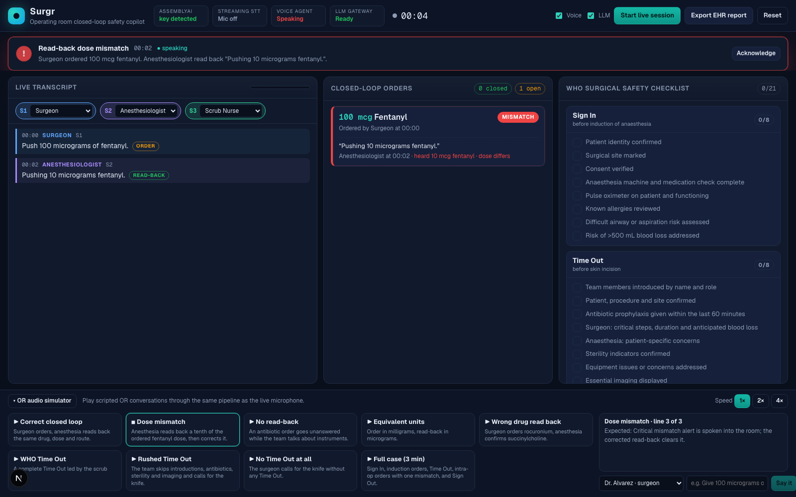

# Surgr — Operating Room Closed-Loop Safety Copilot

Surgr listens to the operating room, tells the surgeon from the anesthesiologist from the scrub nurse, verifies that every spoken drug order gets a correct verbal read-back, tracks the WHO Surgical Safety Checklist as the team speaks it, **speaks a warning into the room** when something is wrong, and exports an audit-ready operative communication record where every line links to the audio timestamp.

Built for the [AssemblyAI Voice Agent Hackathon](https://lablab.ai/ai-hackathons/assemblyai-voice-agent-hackathon) on lablab.ai.



## AssemblyAI stack

| Surgr layer | AssemblyAI product |
|---|---|
| Live OR transcription | Streaming v3 `universal-3-6-pro` with `domain: medical-v1`, `keyterms_prompt` (drug names, checklist phrases), `format_turns` |
| Who is speaking | Streaming `speaker_labels` (true diarization on a single mic) |
| Ambiguous drug utterances | LLM Gateway with JSON-schema outputs (native `response_format` when the account's model supports it, prompt-embedded schema otherwise) |
| Spoken warnings | Voice Agent API session driven with `reply.create` |
| Operative record narrative | LLM Gateway |
| Browser auth | Short-lived tokens from `/v3/token` and `/v1/token`; the API key never leaves the server |

## Run it

```bash
npm install
cp .env.example .env.local   # then paste your key into ASSEMBLYAI_API_KEY
npm run dev
```

Open http://localhost:3000 for the landing page and http://localhost:3000/app for the cockpit. Use Chrome or Edge for the live microphone.

The landing page draws its own operating-room ambience on a canvas (surgical lamp, dust motes, sweeping ECG and pulse-ox traces), so it needs no media assets. To layer photography underneath, add `public/backdrops/hero.jpg` and `public/backdrops/capabilities.jpg` (16:9, dark); they are picked up automatically with a slow Ken Burns drift. To use video instead, set `HERO_VIDEO` / `CAPABILITIES_VIDEO` in the landing components to an MP4 URL.

Without a key the simulator, rule-based read-back engine, checklist and local report all still work; the voice falls back to the browser's speech synthesis.

### LLM Gateway model access

Gateway model access is per account. Surgr asks for Claude first and falls back automatically to `qwen3.5-4b-32k-fast`, which every account can use (override with `SURGR_CLASSIFY_MODEL`, `SURGR_REPORT_MODEL`, `SURGR_FALLBACK_MODEL`). Hackathon accounts are limited to **2 gateway requests per minute**, so the deterministic rule classifier does the real-time work and the LLM is consulted only for drug-related utterances the rules could not resolve, plus the end-of-case narrative. Rate limits are read from the gateway's `x-ratelimit-*` headers and honoured with a client-side back-off.

## Demo flow (what judges see)

1. **Play a scenario** in the OR audio simulator at the bottom (or click *Start live session* and speak).
2. Watch the **transcript** colour each speaker by role, the **closed-loop order board** open a 10-second read-back countdown for every drug order, and the **WHO checklist** tick items as they are said.
3. Trigger *Dose mismatch*, *No read-back*, *Rushed Time Out* or *No Time Out at all* and hear Surgr **speak the alert** into the room.
4. Click **Export EHR report** for the structured record with timestamp links back into the transcript, JSON download and print view.

No second person for a live-microphone test? Play `public/audio/rehearsal-two-voices.m4a` (also served at `/audio/rehearsal-two-voices.m4a`) from a phone held near the laptop's microphone: it is a 78-second scripted exchange in three synthesized voices covering a correct read-back, a dose mismatch with correction, a ten-second timeout, and a rushed Time Out. Do not play it from the laptop itself; the browser's echo cancellation suppresses audio the same machine is producing.

Recording or demoing alone with your own voice? Turn on **Solo demo** in the header. With one voice playing every role, speaker labels put the order and its read-back on the same speaker, which Surgr would otherwise flag as a self-read-back; solo mode accepts it and notes the setting in the report.

The Voice Agent session is opened when a session or scenario starts, closed after 90 seconds without an alert or when the tab is hidden, and reopened on the next alert, so idle tabs do not hold a billable session.

## How it works

```
Browser mic ──PCM16 16 kHz──▶ AssemblyAI Streaming v3 (medical mode, speaker labels)
                                     │ Turn events (speaker, words, timestamps)
                                     ▼
                     Rule classifier (sub-millisecond) ──ambiguous──▶ LLM Gateway (Claude)
                                     │ drug_order / read_back / checklist_item / phase
                                     ▼
                 Read-back state machine · WHO checklist tracker · alert engine
                        │                                      │
                        ▼                                      ▼
        Voice Agent API session (reply.create)       LLM Gateway operative record
        speaks the alert into the OR                 with audio-timestamp links
```

- `src/lib/drugs.ts` — 48 OR drugs with aliases, spoken-number parsing, unit conversion (0.1 mg == 100 mcg), route extraction.
- `src/lib/classifier.ts` — deterministic order / read-back / checklist / phase detection.
- `src/lib/readback.ts` — pure reducer: orders, 10 s deadlines, mismatch detection (drug, dose, route), self-read-back detection, checklist phases, alerts.
- `src/lib/checklist.ts` — the 21 WHO checklist items with spoken-phrase patterns.
- `src/hooks/useStreaming.ts` — mic → AudioWorklet → AssemblyAI WebSocket.
- `src/hooks/useVoiceAgent.ts` — Voice Agent session used as the room loudspeaker, with speech-synthesis fallback.
- `src/app/api/*` — token minting, LLM Gateway classification and report enrichment.
- `src/components/landing/*` — Hero and Capabilities sections (Framer Motion blur-in, word-by-word `BlurText`, fading background video, liquid-glass UI).

Run the scenario regression without a browser:

```bash
npx tsx scripts/simulate.ts
```

## Environment

| Variable | Purpose |
|---|---|
| `ASSEMBLYAI_API_KEY` | Required for live streaming, Voice Agent and LLM Gateway |
| `SURGR_CLASSIFY_MODEL` | Optional, default `claude-haiku-4-5-20251001` (falls back if the account lacks access) |
| `SURGR_REPORT_MODEL` | Optional, default `claude-sonnet-4-6` (falls back if the account lacks access) |
| `SURGR_FALLBACK_MODEL` | Optional, default `qwen3.5-4b-32k-fast` |
| `SURGR_VOICE_ID` | Optional, default `george` |

Protocol checks that run against the live services from Node (need the key in `.env.local`):

```bash
node scripts/voice-agent-check.mjs   # token -> session.update -> reply.create -> audio
node scripts/streaming-check.mjs     # token -> Begin with medical mode + speaker labels -> Terminate
```
